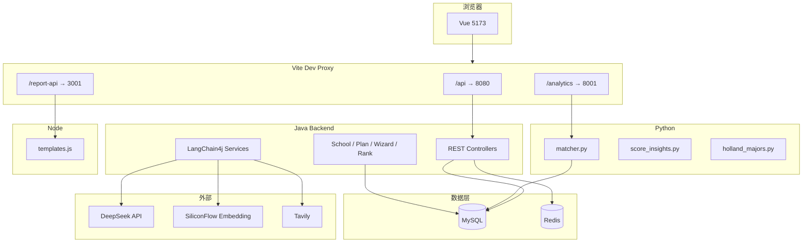

# 核心技术

## 1. 技术栈总览

| 层级 | 技术 | 版本/说明 |
|------|------|-----------|
| 后端框架 | Spring Boot | 3.5.x |
| 语言 | Java | 17 |
| ORM | MyBatis-Plus | 逻辑删除、Lambda 查询 |
| AI 框架 | LangChain4j | 对话、流式、Embedding、Redis 向量存储 |
| 大模型 | DeepSeek | `deepseek-v4-flash`（chat + streaming） |
| 向量模型 | SiliconFlow | `BAAI/bge-large-zh-v1.5` |
| 联网搜索 | Tavily | 聊天页可开关 |
| 缓存/向量 | Redis | localhost:6379 |
| 数据库 | MySQL 8 | `volunteer_assistant` |
| 认证 | JWT | 24h 过期，前端 Axios 拦截器附带 Bearer |
| 前端 | Vue 3 + Vite 7 | Composition API、`<script setup>` |
| UI | Element Plus | 组件库 + 图标 |
| 状态 | Pinia | auth、chat 等 |
| 地图 | Leaflet | 地图选校页 |
| 分析服务 | Python 3 + FastAPI | 端口 8001 |
| 报告服务 | Node.js + Express | 端口 3001 |

## 2. 系统架构



## 3. 后端 API 分组

前缀均为 `/api`（除健康检查外需 JWT 的接口由 Security 配置控制）。

| 前缀 | 能力 |
|------|------|
| `/auth` | 注册、登录、用户信息 |
| `/chat` | 流式对话、会话管理 |
| `/schools` | 分页、详情、对比、地图标记、`POST /ensure-matcher-data` 样本补全 |
| `/majors` | 专业分页、详情、对比 |
| `/rank` | 一分一段位次查询 |
| `/interest-test` | 霍兰德题目、提交、AI 解读流 |
| `/wizard` | 填报向导进度、分步保存、`stepDetails` |
| `/plans` | 志愿方案 CRUD、`POST .../review` AI 评审流 |
| `/favorites` | 院校收藏 |
| `/stats` | 看板统计 |

## 4. Python 分析服务

**基础路径**：经 Vite 代理为 `/analytics`，实际服务 `http://localhost:8001`。

| 方法 | 路径 | 说明 |
|------|------|------|
| POST | `/api/v1/admission/match` | 冲稳保：院校省 + 生源省 + 分数 + 科类 |
| POST | `/api/v1/admission/insights` | 样本分布、线差、扎堆提示 |
| POST | `/api/v1/holland/major-map` | RIASEC → 专业门类建议 |

**核心算法（`matcher.py`）**：

- 按 `school_info.location` / 城市解析 **院校所在地**
- 按 `admission_score.province` 匹配 **录取生源省** 历年线
- 分档：冲 / 稳 / 保；样本不足时 `score_synth.py` 合成兜底
- 样本极度扎堆时启用相对分档

## 5. Node 报告服务

| 方法 | 路径 | 说明 |
|------|------|------|
| POST | `/api/v1/report/volunteer-brief` | 冲稳保结果 HTML |
| POST | `/api/v1/report/holland-brief` | 霍兰德报告 |
| POST | `/api/v1/report/school-compare` | 对比表 HTML |

模板集中在 `Services/report-service/templates.js`，前端 `downloadHtml.js` 触发浏览器下载。

## 6. AI 能力实现要点

### 6.1 智能问答

- 前端：`chatStream` → `POST /api/chat/stream`（SSE 或分块流）
- 后端：`ChatController` + LangChain4j `AiServices`
- 记忆：Redis 向量 + `memoryId`（会话维度）
- RAG：院校/政策文档嵌入检索（resources 下资料）
- 联网：`tavily` 配置 + 前端 `searchEnabled` 开关

### 6.2 志愿推荐 vs 冲稳保

| 能力 | 实现 | 特点 |
|------|------|------|
| `/recommend` | Java AI 流式生成 | 自然语言方案，偏解读 |
| `/matcher` | Python 规则 + DB | 结构化冲/稳/保列表，可保存方案 |

### 6.3 霍兰德测评

- 答题与计分：Java `InterestTestController`
- 专业映射建议：洞察页可调 Python `holland/major-map`
- AI 解读：`interpretHollandStream` → `POST /api/interest-test/interpret`

### 6.4 志愿方案 AI 评审

- 表：`volunteer_plan`（JSON 存储冲稳保条目）
- `PlanReviewService`：LangChain4j 流式输出评审意见

## 7. 录取样本补全（Java）

`ProvincialAdmissionCoverageServiceImpl`：

- **`ensureLocalCoverage`**：某省本地院校 × 近 5 年 × 文理，写入 `admission_score`
- **`ensureMatcherPair(院校省, 生源省)`**：
  - 两省相同：仅本地，不跨省
  - 两省不同：本地 + **单目标省** 复制（分数按 `CROSS_OFFSET` 偏移）
- 性能：预加载已有 `(schoolCode|year|batch)` 键，避免逐条 `selectCount`

## 8. 前端工程要点

- **代理**：`vite.config.js` 中 `/api`、`/analytics`、`/report-api`
- **请求**：`src/api/request.js`，默认超时 30s；补全样本接口单独 90s
- **路由守卫**：`meta.requiresAuth` → 跳转 `/login?redirect=`
- **全屏布局**：`/`、`/chat`、`/interest-test` 无顶栏容器

## 9. 关键配置项

`Backend/src/main/resources/application.yaml`：

```yaml
consultant.data:
  run-sql-on-startup: false          # 不在启动时执行 classpath SQL
  import-undergraduate-schools: false
  seed-sample-admission-scores: false

langchain4j.open-ai.chat-model:      # DeepSeek
langchain4j.open-ai.embedding-model: # SiliconFlow
spring.datasource:                   # MySQL
spring.data.redis:                   # Redis
jwt.secret / jwt.expiration
tavily.api-key
```

## 10. 扩展与维护建议

1. 生产部署：Nginx 统一反代 `/api`、`/analytics`、`/report-api`，前端 `npm run build` 静态托管
2. 密钥：使用 `SPRING_APPLICATION_JSON` 或环境变量覆盖 yaml
3. 大数据量：录取样本优先 SQL 脚本离线导入，在线「补全」仅补当前省对
4. 测试冲稳保：确保 Python 8001 在线 + MySQL 有对应省 `admission_score`
